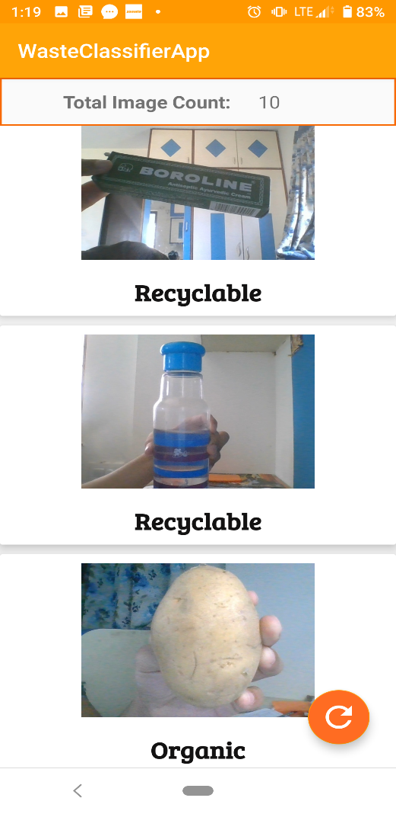
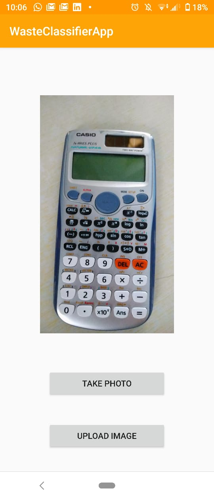

  # Waste Classifier System Using Machine Learning and Computer Vision with Android App
A small scale representation of automating the waste segregation process by using Machine Learning, Computer Vision and Android 

## 1. Camera Detects an Object

 

## 2. Object is Classified as Organic or Recyclable Waste

 

## 3. Instantly Updates on App through Database
<kbd></kbd>  
 
<kbd></kbd>

## In a real waste plant setting, a mechanism to segregate the waste based on the prediction of the model can be implemented.

 

## Phone's camera can be used too.. 

<kbd></kbd> 

