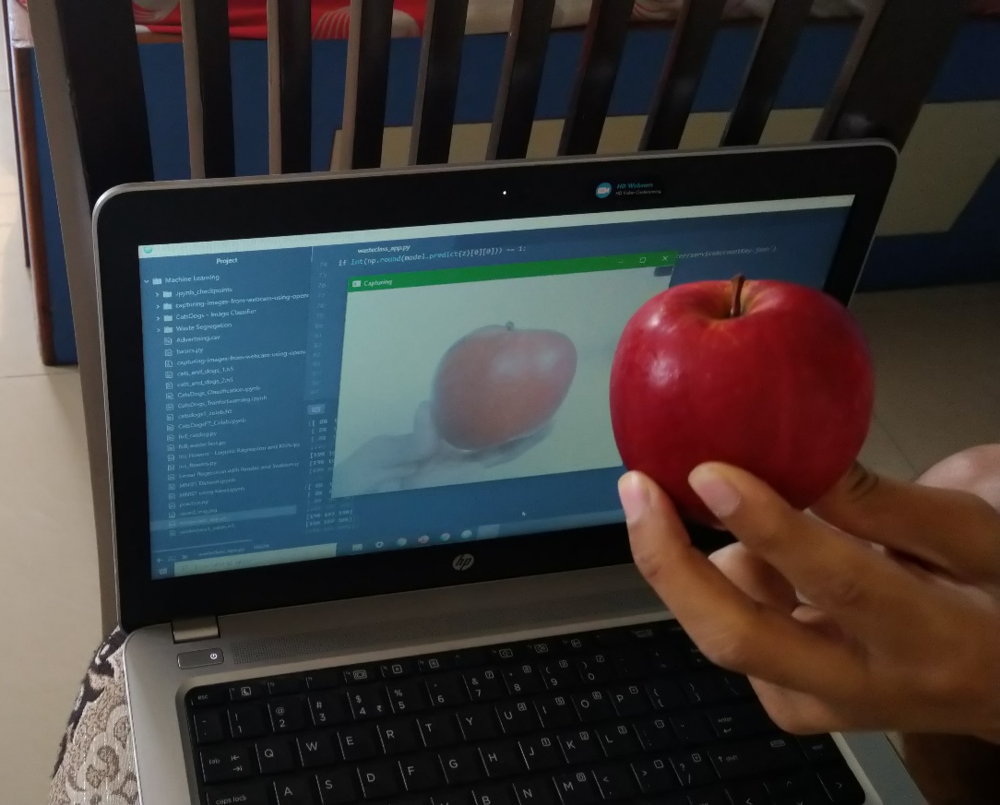
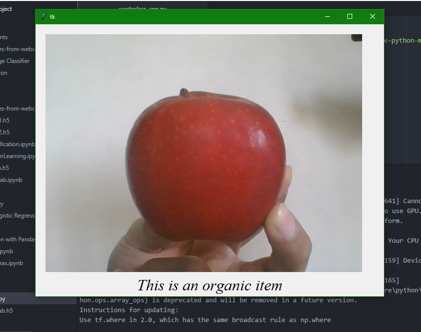
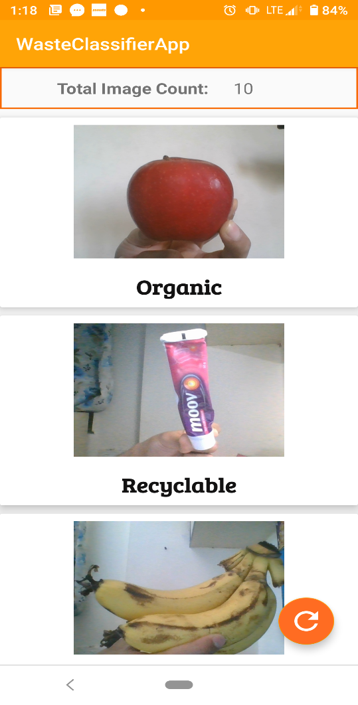

  # Waste Classifier System Using Machine Learning and Computer Vision with Android App
A small scale representation of automating the waste segregation process by using Machine Learning, Computer Vision and Android 

### 1. The camera detects an image

 

### 2. CNN Model predicts the result

 

### 3. Instantly updates on App through Database

